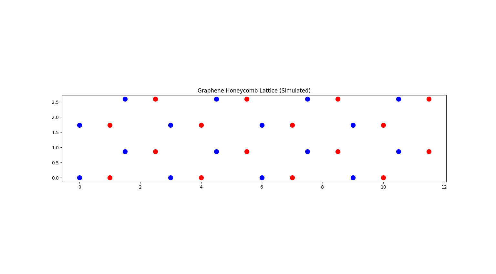
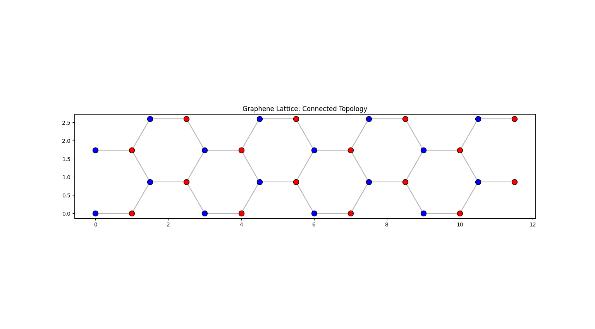

# Graphene Nanotransistor Logic Simulation
**Exploring Post-Silicon Computing through 2D Material Modeling**

## 📌 Project Overview
As Silicon transistors approach the 5nm physical limit, "Quantum Tunneling" causes excessive heat and data leakage. This project simulates **Graphene Field-Effect Transistors (GFETs)** as a potential successor, using Python-based coordinate modeling and SQL data management.

## 🚀 Current Progress: Phase 2 (Connectivity)
We have successfully transitioned from raw atomic coordinates to a **Connected Topology**.

### Key Accomplishments:
* **Lattice Generation:** Created a 32-atom finite graphene sheet with distinct A and B sub-lattices.
* **SQL Integration:** Automated the export of atomic metadata to a MySQL database for persistent storage.
* **Neighbor Analysis:** Implemented a distance-threshold algorithm to map "Hopping Paths"—the routes electrons take through the material.

## 🔬 Visual Evidence
| Initial Lattice | Connected Mesh |
| :--- | :--- |
|  |  |

> **Note on Topology:** Our connectivity tests confirm a bipartite lattice where each interior Carbon atom maintains a coordination number of 3, matching theoretical graphene standards.

## 🛠️ Tech Stack
* **Language:** Python (NumPy, Matplotlib, SciPy)
* **Database:** MySQL (Storage of spatial coordinates and atom types)
* **Research Focus:** Tight-Binding Model, Logic Gate Switching, Nanotransistor Scalability.

**Successfully generated a $32 \times 32$ Adjacency Matrix from the SQL lattice data. This matrix represents the digital topology of the Graphene sheet, enabling future Hamiltonian-based transport simulations.**
